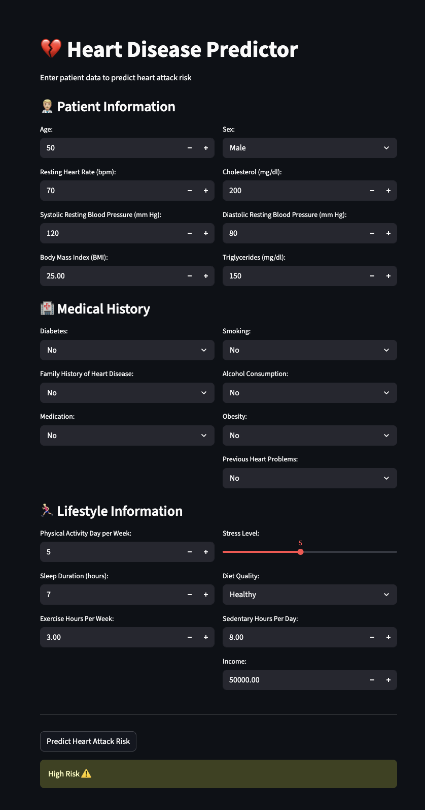

# 💔 Heart Disease Predictor

An end-to-end Machine Learning web application that predicts heart attack risk based on patient health data. Built with XGBoost and deployed as an interactive Streamlit app.

🔗 **[Try the Live App →](https://huggingface.co/spaces/krushalkalkani/heart-disease-predictor)**

---

## About the Project

Heart disease is one of the leading causes of death worldwide. Early risk assessment can help patients and doctors take preventive action. This project uses machine learning to predict whether a patient is at high or low risk of a heart attack based on 23 health and lifestyle features including age, cholesterol, blood pressure, BMI, smoking status, and more.

This was built as a complete end-to-end ML project — from raw data exploration to a live deployed web app.

---

## Demo



---

## Tech Stack

- **Language:** Python
- **ML Models:** Logistic Regression, Random Forest, XGBoost
- **Libraries:** scikit-learn, XGBoost, Pandas, NumPy, Matplotlib, Seaborn
- **Frontend:** Streamlit
- **Deployment:** Hugging Face Spaces (Docker)
- **Version Control:** Git & GitHub

---

## How It Works

```
Raw Dataset (8,763 patients, 26 features)
        ↓
   Data Exploration & EDA
        ↓
   Preprocessing
   • Dropped irrelevant columns (Patient ID, Country, Continent, Hemisphere)
   • Split Blood Pressure into Systolic & Diastolic
   • Label encoded Sex, one-hot encoded Diet
   • Scaled features with StandardScaler
        ↓
   Model Training & Comparison
   • Logistic Regression
   • Random Forest
   • XGBoost ← Best performer
        ↓
   Streamlit Web App
   • User inputs patient data via interactive UI
   • Model predicts High Risk or Low Risk
        ↓
   Deployed on Hugging Face Spaces
```

---

## Key Challenges & Learnings

**Class Imbalance:** The dataset had ~64% low-risk and ~36% high-risk patients. All three models initially predicted "no heart attack" for almost everyone, resulting in near-zero recall. Fixed this by using `class_weight='balanced'` for Logistic Regression and Random Forest, and `scale_pos_weight` for XGBoost.

**Preprocessing Order Bug:** Saved training data _before_ scaling it, which meant models were training on unscaled features. Learned that the correct pipeline order is: Split → Scale → Save.

**Weak Dataset Signal:** This is a synthetic Kaggle dataset where features don't have strong real-world correlation with heart attack risk. Even with tuning, model performance plateaus around 65% accuracy. This taught me that no amount of model optimization can fix fundamentally weak data — a valuable real-world lesson.

**First Deployment:** Learned how to containerize a Streamlit app using Docker and deploy it on Hugging Face Spaces, making the project accessible to anyone with a URL.

---

## Project Structure

```
heart-disease-predictor/
├── app.py                              # Streamlit web application
├── explore.py                          # Phase 1: Exploratory Data Analysis
├── preprocess.py                       # Phase 2: Data cleaning & feature engineering
├── train.py                            # Phase 3: Model training & comparison
├── model.pkl                           # Saved XGBoost model
├── scaler.pkl                          # Saved StandardScaler
├── heart_attack_prediction_dataset.csv # Raw dataset
├── requirements.txt                    # Python dependencies
└── README.md                           # You are here
```

---

## Run Locally

1. **Clone the repository**

   ```bash
   git clone https://github.com/krushaalkalkani/heart-disease-predictor.git
   cd heart-disease-predictor
   ```

2. **Create a virtual environment**

   ```bash
   python3 -m venv venv
   source venv/bin/activate  # Mac/Linux
   ```

3. **Install dependencies**

   ```bash
   pip install -r requirements.txt
   ```

4. **Run the preprocessing and training pipeline**

   ```bash
   python preprocess.py
   python train.py
   ```

5. **Launch the Streamlit app**
   ```bash
   streamlit run app.py
   ```

---

## Dataset

- **Source:** [Kaggle - Heart Attack Prediction Dataset](https://www.kaggle.com/datasets/iamsouravbanerjee/heart-attack-prediction-dataset)
- **Size:** 8,763 rows × 26 columns
- **Target Variable:** Heart Attack Risk (0 = Low Risk, 1 = High Risk)

---

## Author

**Krushal Kalkani**

- [GitHub](https://github.com/krushaalkalkani)
- [LinkedIn](https://linkedin.com/in/krushaalkalkani)

---

## License

This project is open source under the [MIT License](LICENSE).
